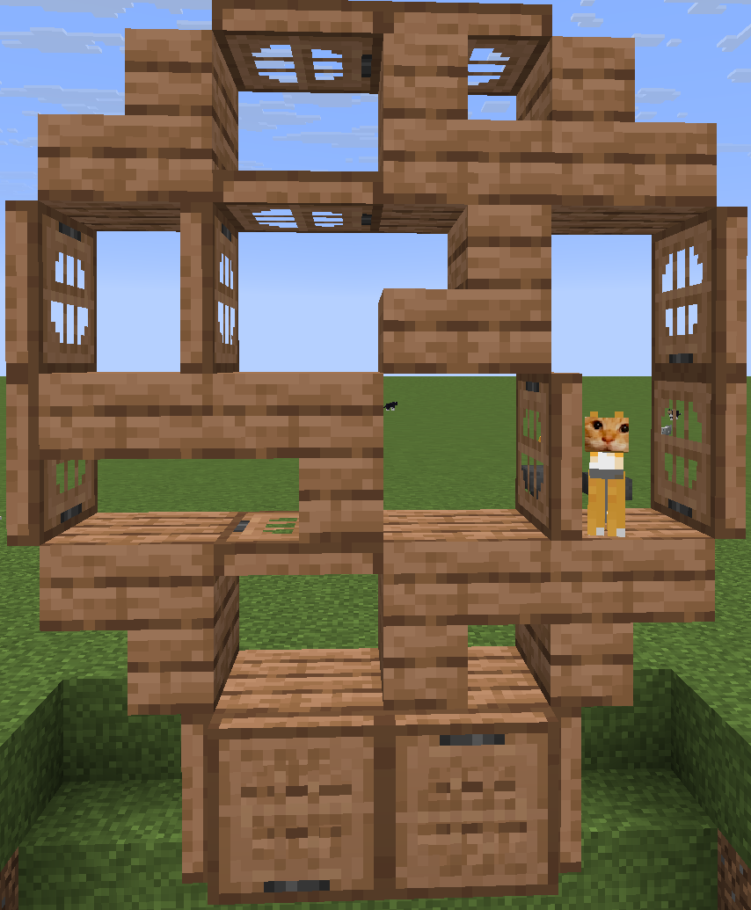

# laowu meme

Minecraft 26.1.2 Fabric 整活 mod（本分支 `26.1.2fabric`；其他 MC 版本见 `26.2fabric` / `1.21.11fabric` / `1.21.1fabric` 分支）。

一只命名为「老吴」的猫和任意一只猫靠近时，会头对头歪头旋转、体型放大、并随机播放两种 BGM；右键其中一只猫即可打断，两只猫自然走开。支持单人与多人，多人下服务端权威同步、所有玩家看到的效果完全一致。

## 效果

一只命名为"老吴"的猫和 6 格内任意一只猫触发：
- 两只猫先走到一起、身体面对面锁定，头各自歪头（镜像歪头）+ 弓背哈气姿势 + 体型放大
- 随机循环播放选定的 BGM 之一（16 格内玩家听到）
- 玩家右键任意一只猫打断，两只猫自然走开
- 被打断的这对猫 3 分钟内不再触发

## 耄耋猫（多方块结构）

除了「老吴猫」，本 mod 还有一套**耄耋猫**玩法：用**任意木系方块**（橡木/云杉/桦木/丛林/金合欢/深色橡木/樱桃木/红木/诡异木等均可，混搭也行）搭一个立面结构，附近一只命名为「耄耋」的猫会被召到结构座位上；猫坐下后，玩家 5 格内持续循环播放哈气音效、并转头看向最近的玩家；破坏结构即解除。



### 效果

- 结构被识别后，服务端在 10 格内找一只命名为「耄耋」的猫，teleport 到**锚点楼梯顶**并令其坐下（不冻结 AI）。
- 猫坐好后：玩家进入 **5 格** 范围 → 循环播放哈气音效（`maodie.ogg`，16 格内可闻、自然衰减）；猫会**转头盯最近的玩家**。离开范围即停。
- 破坏结构任一部件（尤其锚点楼梯）→ 解除，猫恢复自由站立走开。
- **命名贴图**：任意一只猫命名为「耄耋」后，底图换成对应它自身花色的「哈基米」风格贴图（成猫；幼猫保持原版贴图，避免报错）。换皮纯客户端、按名字判定，不依赖结构。

## 命名换皮（奶猫）

任意猫命名为「**奶猫**」后，底图换成可爱的黄色卡通猫贴图（所有花色共用同一张）。换皮纯客户端、按名字判定，与「耄耋」换皮互不干扰；成猫生效，幼猫保持原版贴图。

## 铲子拍扁

手持**铲子**（任意材质）右键猫 → 猫被拍扁成"干"字形（身体压扁、四肢向两侧张开），**8 秒后自动弹回**。拍扁会解除当前的对头配对；服务端权威，多人一致。

### 搭建多方块结构

这是一面「猫窝墙」：在地面上沿水平方向铺一个 **6 宽（x:0~5）× 6 高（y:0~5）** 的立面，所有方块都在**同一 z 层**（厚度 1 格）。**任意木系方块均可**（木板 / 楼梯 / 活板门 / 台阶），不同木种可以混搭。

立面图（y 从上到下，x 从左到右；原点 `[0,0,0]` 为最左下角的地基层）：

```
y\x    0     1     2     3     4     5
 5    [ ]   [ ]   [T]   [T]   [ ]   [ ]
 4    [ ]   [S]   [T]   [S]   [S]   [ ]
 3    [T]   [T]   [ ]   [S]   [ ]   [T]
 2    [T]   [L]   [S]   [ ]   [T]   [T]
 1    [ ]   [S]   [T]   [S]   [S]   [ ]   ← 锚点楼梯在 x=4,y=1（猫坐其顶上）
 0    [ ]   [T]   [P]   [P]   [T]   [ ]
```

图例：`S`=楼梯 stairs　`T`=活板门 trapdoor　`P`=木板 planks　`L`=台阶 slab　`[ ]`=空气（不放）

坐标与状态清单（共 23 个方块，相对原点 `[0,0,0]`）：

| 坐标 (x,y,z) | 方块类型 | 关键状态 |
|---|---|---|
| 1,0,0 | 活板门 | 下半、开 |
| 2,0,0 | 木板 | — |
| 3,0,0 | 木板 | — |
| 4,0,0 | 活板门 | 下半、开 |
| 1,1,0 | 楼梯 | 上半、直 |
| 2,1,0 | 活板门 | 上半、关 |
| 3,1,0 | 楼梯 | 上半、直 |
| **4,1,0** | **楼梯** | **上半、直（锚点 / 猫座位）** |
| 0,2,0 | 活板门 | 上半、开 |
| 1,2,0 | 台阶 | 上半 |
| 2,2,0 | 楼梯 | 上半、直 |
| 4,2,0 | 活板门 | 下半、开 |
| 5,2,0 | 活板门 | 上半、开 |
| 0,3,0 | 活板门 | 下半、开 |
| 1,3,0 | 活板门 | 下半、开 |
| 3,3,0 | 楼梯 | 下半、直 |
| 5,3,0 | 活板门 | 上半、开 |
| 1,4,0 | 楼梯 | 下半、直 |
| 2,4,0 | 活板门 | 下半、关 |
| 3,4,0 | 楼梯 | 下半、直 |
| 4,4,0 | 楼梯 | 下半、直 |
| 2,5,0 | 活板门 | 下半、关 |
| 3,5,0 | 活板门 | 下半、关 |

> **木种不限**：上表中「木板/楼梯/活板门/台阶」可用任意木系方块替代（橡木/云杉/桦木/丛林/金合欢/深色橡木/樱桃木等），不同位置可以用不同木种混搭。活板门的 `facing`（朝向）可以任意摆放，mod 匹配时会自动忽略。

> **懒人方案**：本仓库提供 Litematica 投影文件 `docs/耄耋的家.litematic`，装 Litematica 模组后直接加载投影即可一键摆好整面结构（投影里 `[3,2,0]` 处有一个黑蜡烛，可放可不放，mod 不检查该位置）。

### 搭建规则与提示

- **锚点楼梯 `[4,1,0]`**：猫 teleport 到其上方一格 `[4,2,0]`，坐在楼梯顶（不是落在活板门上）。
- **木种不限**：整面结构可以用任意木系方块（橡木/云杉/桦木/丛林/金合欢/深色橡木/樱桃木等），不同位置可以混搭不同木种。mod 只认方块**类型**（楼梯就是楼梯、活板门就是活板门），不限制具体木种。
- **活板门朝向（facing）可以任意摆**——结构匹配时忽略活板门朝向，怎么转都认；但**开/关（open）、上半/下半（half）必须与清单一致**。
- **楼梯朝向跟随结构旋转**：结构可以**整体旋转 90°/180°/270°** 摆放，mod 会自动识别 4 个朝向；楼梯朝西/朝东等表述不再适用——你按自己喜欢的方向搭，楼梯朝向与结构朝向一致即可（mod 内部随旋转一起比对）。活板门朝向仍任意。
- 需要一只命名为「耄耋」的猫在结构 **10 格内**；服务端每 20 tick 扫描识别，识别成功即召猫就座。
- 破坏任一部件（尤其锚点楼梯）→ 解除，猫恢复自由。

服务端权威架构：多人模式下服务端必须装此 mod（整活逻辑在服务端），客户端装了才有歪头 / 放大 / 弓背哈气 / 音乐；单人模式自动包含两端。

## 构建

需要 JDK 25（Minecraft 26.1 是首个不混淆版本，开发强制要求 Java 25）。

在本机 `~/.gradle/gradle.properties` 配置：
```
org.gradle.java.home=<你的 JDK 25 路径>
```

```bash
./gradlew build
# 产物：build/libs/laowu_meme-<版本>+26.1.2.jar（如 laowu_meme-1.2.0+26.1.2.jar）
```

## 部署

把 jar 放进 `mods/` 目录。多人服：服务端与客户端都要装（服务端跑整活逻辑，客户端做渲染 / 音效）；单人：装一份即可（两端自动包含）。

## 版本

- 当前 mod 版本：2.0.0
- Minecraft 26.1.2
- Fabric Loader 0.19.2
- Fabric API 0.152.1+26.1.2
- Java 25 / Gradle 9.5.1 / Loom 1.17-SNAPSHOT

## 音频

### 内置音频

音频文件（`laowu2.ogg` / `qiliang.ogg`）未包含在仓库中，请自行放入 `src/main/resources/assets/laowu_meme/sounds/`。
需 Ogg Vorbis 格式（MC 只支持 ogg），可用 ffmpeg 从 mp3 转换：
```
ffmpeg -i input.mp3 -c:a libvorbis -q:a 4 -ar 44100 -ac 1 output.ogg
```

### 导入音频（运行时热插拔）

在游戏内打开本 mod 的配置界面（触发整活后按 Escape 或 Mod 菜单进入），点击「打开音频文件夹」会打开 `config/laowu_meme/sounds/`。
把 `.ogg` 文件放进该文件夹，**重新打开配置界面**即可看到并启用，触发整活时会随内置音频一起随机播放；无需重启游戏，也无需 F3+T 重载。

- **导入音频必须是 `.ogg`（Ogg Vorbis）格式**——Minecraft 只支持 ogg，放 mp3 / wav 等其他格式不会被播放。
- 如果你手上是 mp3，可用在线网站先转成 ogg，例如 **FreeConvert**（https://www.freeconvert.com/mp3-to-ogg）或其他同类站点（CloudConvert、OnlineConvert 等），转完把下载到的 `.ogg` 丢进上面的文件夹即可。
- 配置界面里每条音频都可单独启用 / 禁用，禁用状态会记到 `config/laowu_meme/enabled.properties`，下次进游戏仍生效。
## 友链
类似mod:catfight-mod  Minecraft Fabric 1.20.1
https://github.com/ATLCNND/catfight-mod 
## 致谢

- 猫贴图来自 **maocraft 材质包**，作者 **一A化三哈**，B 站主页：https://space.bilibili.com/1756604526 。本 mod 将其全套家猫花色贴图内置为「耄耋」命名猫的专属外观，特此感谢授权使用。

## License

MIT
